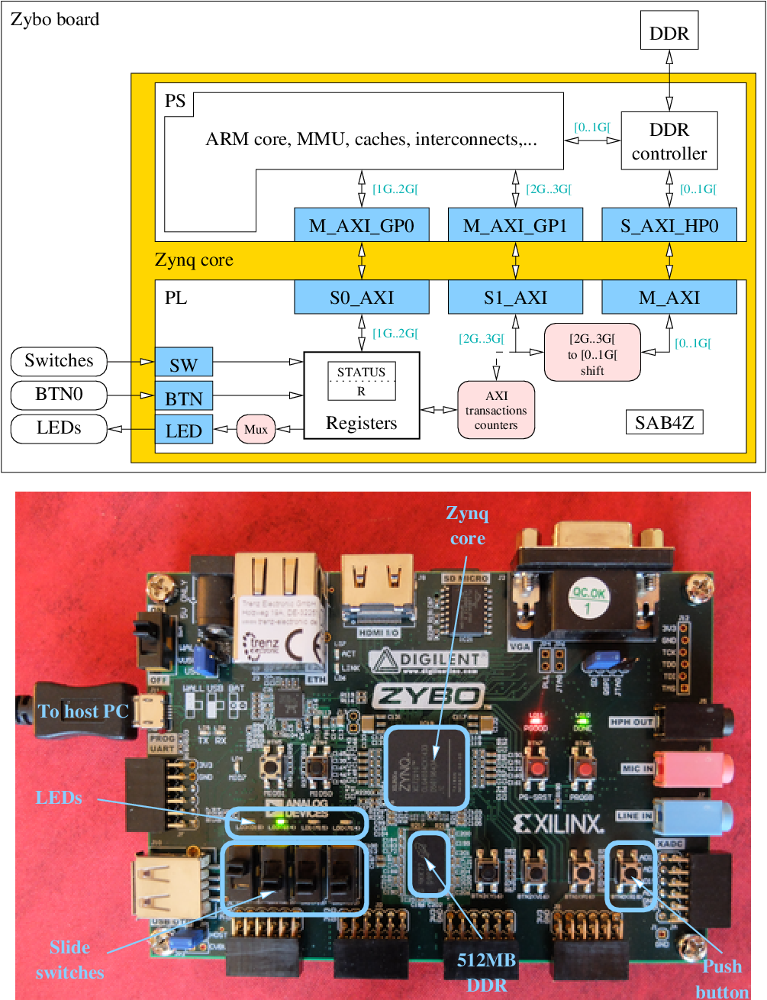

This repository and its sub-directories contain the VHDL source code, VHDL simulation environment, simulation and synthesis scripts of SAB4Z, a simple design example for the Xilinx Zynq core. It can be ported on any board based on Xilinx Zynq cores but has been specifically designed for the Zybo board by Digilent.

# Table of content
1. [License](#license)
1. [Content](#Content)
1. [Description](#Description)
1. [Installing from the archive](#Archive)
1. [Running](#Running)
1. [Building from scratch](#Building)
1. [Going further](#Further)

# License

Copyright Telecom ParisTech  
Copyright Renaud Pacalet (renaud.pacalet@telecom-paristech.fr)

Licensed uder the CeCILL license, Version 2.1 of
2013-06-21 (the "License"). You should have
received a copy of the License. Else, you may
obtain a copy of the License at:

http://www.cecill.info/licences/Licence_CeCILL_V2.1-en.txt

# Content

    .
    ├── C
    │   └── hello_world.c
    ├── COPYING
    ├── COPYING-FR
    ├── COPYRIGHT
    ├── hdl
    │   ├── axi_pkg.vhd
    │   ├── debouncer.vhd
    │   ├── sab4z.vhd
    │   └── utils.vhd
    ├── images
    │   ├── sab4z.fig
    │   ├── sab4z.png
    │   └── zybo.png
    ├── Makefile
    ├── README.md
    ├── scripts
    │   ├── boot.bif
    │   ├── dts.tcl
    │   ├── fsbl.tcl
    │   └── vvsyn.tcl
    └── sdcard.tgz

# Description

**SAB4Z** is a **S**imple **A**xi-to-axi **B**ridge **F**or **Z**ynq cores with two slave AXI ports (S0_AXI and S1_AXI), one master AXI port (M_AXI), two internal registers (STATUS and R), a 4-bits input (SW), a 4-bits output (LED) and a one bit command input (BTN). The following figure represents SAB4Z mapped in the Programmable Logic (PL) of the Zynq core of a Zybo board. SAB4Z is connected to the Processing System (PS) of the Zynq core through the 3 AXI ports. When the ARM processor of the PS reads or writes at addresses in the `[0..1G[` range (first giga byte) it accesses the DDR memory of the Zybo (512MB), through the DDR controller. When the addresses fall in the `[1G..2G[` or `[2G..3G[` ranges, it accesses SAB4Z, through its S0_AXI and S1_AXI ports, respectively. SAB4Z can also access the DDR in the `[0..1G[` range, through its M_AXI port. The four slide switches, LEDs and the rightmost push-button (BTN0) of the board are connected to the SW input, the LED output and the BTN input of SAB4Z, respectively.

As shown on the figure, the accesses from the PS that fall in the `[2G..3G[` range (S1_AXI) are forwarded to M_AXI with an address shift from `[2G..3G[` to `[0..1G[`. The responses from M_AXI are forwarded back to S1_AXI. This path is thus a second way to access the DDR from the PS, through the PL. From the PS viewpoint each address in the `[0..1G[` range has an equivalent address in the `[2G..3G[` range. Note that the Zybo board has only 512 MB of DDR and accesses above the DDR limit fall back in the low half (aliasing). Each DDR location can thus be accessed with 4 different addresses in the `[0..512M[`, `[512M..1G[`, `[2G..2G+512M[` or `[2G+512M..3G[` ranges. Note that depending on the configuration, Zynq-based systems have a reserved low addresses range that cannot be accessed from the PL. In these systems this low range can be accessed in the `[0..1G[` range but not in the `[2G..3G[` range where errors are raised. Last but not least, randomly modifying the content of the memory using the `[2G..3G[` range can crash the running software stack or lead to unexpected behaviours if the modified region is currently in use.

The S0_AXI AXI slave port is used to access the internal registers. The mapping of the S0_AXI address space is the following:

| Address       | Mapped resource   | Description                                 | 
| ------------- | ----------------- | ------------------------------------------- | 
| `0x4000_0000` | STATUS (ro)       | 32 bits read-only status register           | 
| `0x4000_0004` | R      (rw)       | 32 bits general purpose read-write register | 
| `0x4000_0008` | Unmapped          |                                             | 
| ...           | Unmapped          |                                             | 
| `0x7fff_fffc` | Unmapped          |                                             | 

The organization of the status register is the following:

| Bits     | Role                                                |
|----------|-----------------------------------------------------|
|  `3...0` | LIFE, rotating bit (life monitor)                   |
|  `7...4` | CNT, counter of BTN events                          |
| `11...8` | ARCNT, counter of S1_AXI address-read transactions  |
| `15..12` | RCNT, counter of S1_AXI date-read transactions      |
| `19..16` | AWCNT, counter of S1_AXI address-write transactions |
| `23..20` | WCNT, counter of S1_AXI data-write transactions     |
| `27..24` | BCNT, counter of S1_AXI write-response transactions |
| `31..28` | SW, current value                                   |

The BTN input is filtered by a debouncer-resynchronizer. CNT is a 4-bits counter. It is initialized to zero after reset. Each time the BTN push-button is pressed, CNT is incremented (modulus 16). As long as the button is kept pressed, CNT is sent to LED. When it is released, the current value of CNT selects which 4-bits slice of which internal register is sent to LED: bits 4\*CNT+3..4\*CNT of STATUS register when 0<=CNT<=7, else bits 4\*(CNT-8)+3..4\*(CNT-8) of R register.

Accesses to the unmapped region of the S0_AXI `[0x4000_0008..2G[` address space raise DECERR AXI errors. Write accesses to the read-only status register raise SLVERR AXI errors.

# Installing from the archive

Insert a micro SD card in your card reader and unpack the provided `sdcard.tgz` archive to it:

    cd sab4z
    tar -C <path-to-mounted-sd-card> sdcard.tgz
    sync

Unmount the micro SD card.

# Using SAB4Z on the Zybo

* Plug the micro SD card in the Zybo and connect the USB cable.
* Check the position of the jumper that selects the power source (USB or power adapter).
* Check the position of the jumper that selects the boot medium (SD card).
* Power on.
* Launch a terminal emulator (minicom, picocom...) with the following configuration:
  * Baudrate 115200
  * No flow control
  * No paritys
  * 8 bits characters
  * No port reset
  * No port locking
  * Connected to the `/dev/ttyUSB1` device (if needed use `dmesg` to check the device name)
  * e.g. `picocom -b115200 -fn -pn -d8 -r -l /dev/ttyUSB1`
* Wait until Linux boots, log in as root and start interacting with SAB4Z (with `devmem`, for instance).

# Building the whole example from scratch

To build the project you will need the Xilinx tools (Vivado and its companion SDK). In the following we assume that they are properly installed and in your PATH. You will also need to download several tools, configure and build them. Some steps can be run in parallel because they do not depend on the results of other steps. Let us first clone all components from their respective Git repositories.

## Downloads

    export XLINUX=<some-path>/linux-xlnx
    export XUBOOT=<some-path>/u-boot-xlnx
    export XDTS=<some-path>/device-tree-xlnx
    git clone https://github.com/Xilinx/linux-xlnx.git $XLINUX
    git clone https://github.com/Xilinx/u-boot-xlnx.git $XUBOOT
    git clone http://github.com/Xilinx/device-tree-xlnx.git $XDTS
    export SAB4Z=<some-path>
    git clone https://gitlab.eurecom.fr/renaud.pacalet/sab4z.git $SAB4Z
    export BUILDROOT=<some-path>
    git clone http://git.buildroot.net/git/buildroot.git $BUILDROOT

## Hardware synthesis

    cd $SAB4Z
    make vv-all

The bitstream `top_wrapper.bit` is at:

    $SAB4Z/build/vv/top.runs/impl_1

## Configure and build the Linux kernel

    export CROSS_COMPILE=arm-xilinx-linux-gnueabi- # (note the trailing '-')
    export PATH=$PATH:<path-to-xilinx-sdk>/gnu/arm/lin/bin
    ${CROSS_COMPILE}gcc --version

Note the toolchain version (result of the last command), we will need it later.

    cd $XLINUX
    make mrproper
    make O=build ARCH=arm xilinx_zynq_defconfig
    make -j8 O=build ARCH=arm zImage

Adapt the `make` -j option to your host system.

Note: if needed the configuration of the kernel can be tuned by running:

    make O=build ARCH=arm menuconfig

before building the kernel. The generated compressed Linux kernel image is:

    ZIMAGE=$XLINUX/build/arch/arm/boot/zImage

The Device Tree Compiler (dtc) is also generated and can be found in:

    $XLINUX/build/scripts/dtc

Add this directory to your PATH, we will need dtc later:

    export PATH=$PATH:$XLINUX/build/scripts/dtc

## Configure and build U-Boot, the second stage boot loader

The U-Boot build process uses dtc. Unless you have another dtc binary somewhere, wait until the Linux kernel is built before building U-Boot.

    cd $XUBOOT
    make mrproper
    make O=build zynq_zybo_defconfig
    make -j8 O=build

Adapt the `make` -j option to your host system.

Note: if needed the configuration of U-Boot can be tuned by running:

    make O=build menuconfig

before building U-Boot. The generated ELF of U-Boot is:

    UBOOT=$XUBOOT/build/u-boot

The mkimage U-Boot utility is also generated and can be found in:

    $XUBOOT/build/tools

Add this directory to your PATH, we will need mkimage later:

    export PATH=$PATH:$XUBOOT/build/tools

## Configure and build a root file system

Buildroot has no default configuration for the Zybo board but the ZedBoard configuration should work also for the Zybo:

    cd $BUILDROOT
    make O=build zedboard_defconfig
    make O=build menuconfig

In the buildroot configuration menus change the following options:

    Build options -> Location to save buildroot config -> ./build/buildroot.config
    Build options -> Enable compiler cache -> yes (faster build)
    Toolchain -> Toolchain type -> External toolchain
    Toolchain -> Toolchain -> Custom toolchain
    Toolchain -> Toolchain path -> <path-to-xilinx-sdk/gnu/arm/lin
    Toolchain -> Toolchain prefix -> arm-xilinx-linux-gnueabi # (no trailing '-')
    Toolchain -> External toolchain gcc version -> <the-toolchain-version-you-noted>
    Toolchain -> External toolchain C library -> glibc/eglibc
    Toolchain -> Toolchain has RPC support? -> yes
    System configuration -> System hostname -> sab4z
    System configuration -> System banner -> Welcome to SAB4Z (c) Telecom ParisTech
    Kernel -> Linux Kernel -> no
    Bootloaders -> U-Boot -> no

Quit with saving. Save the buildroot configuration and build the root file system:

    make O=build savedefconfig
    make O=build

If you get an error:

    Incorrect selection of kernel headers: expected x.x.x, got y.y.y

note the `y.y.y` and run again the buildroot configuration:

    make O=build menuconfig

change:

    Toolchain -> External toolchain kernel headers series -> the-kernel-headers-version-you-noted

quit with saving, save again the configuration and build:

    make O=build savedefconfig
    make O=build

The compressed archive of the root filesystem is:

    ROOTFS=$BUILDROOT/build/images/rootfs.cpio.gz

## Generate and build the hardware dependant software

### Linux kernel device tree

Generate the device tree sources:

    cd $SAB4Z
    make dts

The sources are at `build/dts`. If needed, edit them before compiling the device tree blob with dtc:

    dtc -I dts -O dtb -o build/devicetree.dtb build/dts/system.dts

The device tree blob is:

    build/devicetree.dtb

### First Stage Boot Loader (FSBL)

Generate the FSBL sources

    make fsbl

The sources are in `build/fsbl`. If needed, edit them before compiling the FSBL:

    make -C build/fsbl

The binary of the FSBL is:

    build/fsbl/executable.elf

### Zynq boot image

We are ready to generate the Zynq boot image. First copy the U-Boot ELF:

    cp $UBOOT build/u-boot.elf

and generate the image:

    bootgen -w -image scripts/boot.bif -o build/boot.bin

The boot image is:

    build/boot.bin

### Create U-Boot images of the Linux kernel and root file system

    mkimage -A arm -O linux -C none -T kernel -a 0x8000 -e 0x8000 -d $ZIMAGE build/uImage
    mkimage -A arm -T ramdisk -C gzip -d $ROOTFS build/uramdisk.image.gz

### Prepare the micro SD card

Finally, copy the different components to the micro SD card:

    cd build
    cp boot.bin devicetree.dtb uImage uramdisk.image.gz <path-to-mounted-sd-card>
    sync

Unmount the micro SD card.

# Going further

## Create, compile and run a software application

TODO

## Access SAB4Z from a software application

TODO

## Add a Linux driver for SAB4Z

TODO

## Boot Linux across SAB4Z

TODO

